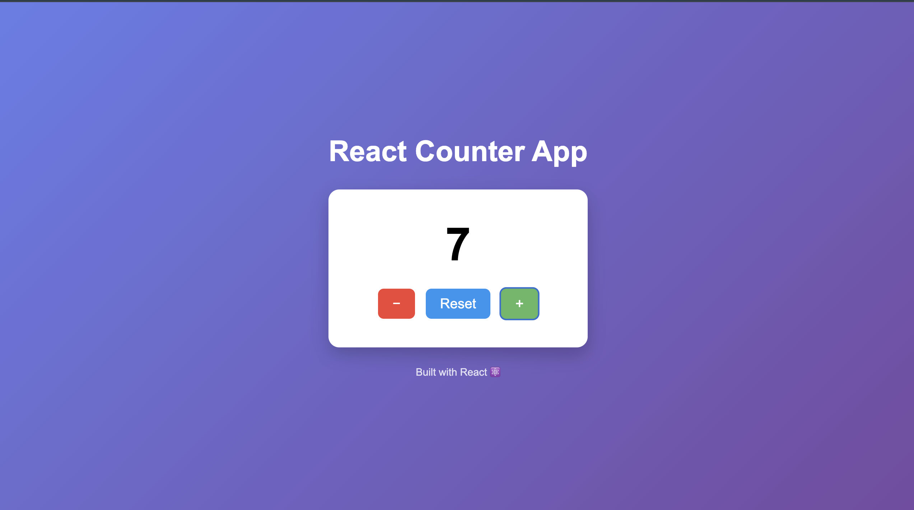

# React Counter App ⚛️

A simple and interactive **Counter Application built with React**.
This project demonstrates the use of **React Hooks (`useState`)**, component structure, and basic UI styling.

---

## 🚀 Features

* Increment the counter
* Decrement the counter
* Reset the counter
* Clean and responsive UI
* Built using **React + Vite**

---

## 🖥️ Preview



---

## 🛠️ Tech Stack

* **React**
* **JavaScript (ES6)**
* **CSS3**
* **Vite**

---

## 📂 Project Structure

```
react-counter-app
│
├── public
│
├── src
│   ├── App.jsx
│   ├── index.css
│   └── main.jsx
│
├── package.json
├── README.md
└── image.png
```

---

## ⚙️ Installation & Setup

Clone the repository

```
git clone https://github.com/Shubh7amydv/React_Project.git
```

Navigate into the project folder

```
cd Counter-Mini-Project
```

Install dependencies

```
npm install
```

Run the development server

```
npm run dev
```

---

## 🎯 Learning Objectives

This project helped in understanding:

* React functional components
* React `useState` hook
* Event handling in React
* Basic UI styling
* Project structure in React apps

---

## 📌 Future Improvements

* Add counter animations
* Add dark mode
* Store counter value using **localStorage**
* Add keyboard controls

---

## 👨‍💻 Author

**Shubham Yadav**

GitHub:
https://github.com/Shubh7amydv
